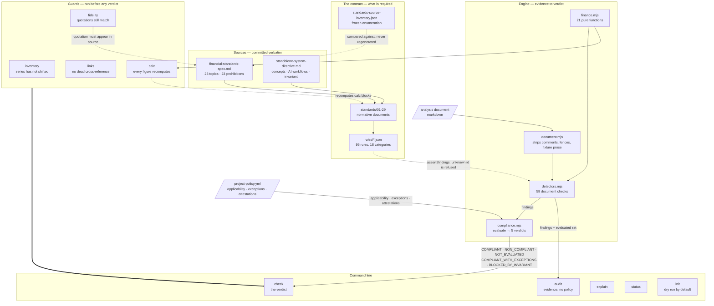

# Architecture — FinancialStandards

> A standalone, auditable system for deciding whether a piece of financial analysis is justified by
> its evidence, mathematics, assumptions, uncertainty, and context. It is not a personal-finance
> library and not a calculator. It answers one question about a document — *does this hold up?* — and
> its permitted answers include "not enough evidence to say" and "I am prohibited from proceeding".

## What it is for

Twenty-nine numbered standards state what a financial analysis must do. Ninety-five catalogued rules
make a subset of that machine-checkable. A command line evaluates a document against a project's
policy and returns one of five verdicts. A suite of guards protects the standards themselves from
being edited into compliance.

The system is deliberately honest about its own reach. Of the 96 rules, **3 claim full assurance**,
58 are lexical checks that establish presence but never correctness, and 33 can only ever be
established by a person. That distribution is published as `frameworkCoverage` beside every verdict —
never folded into it, because a coverage improvement must not be able to read as a compliance
improvement.

## Tech Stack

| Layer | Technology |
|---|---|
| Runtime | Node.js ≥ 18, ESM (`"type": "module"`) |
| Dependencies | **None.** Zero third-party packages, enforced structurally — CI has no install step, so adding one breaks the build |
| Tests | `node:test` + `node:assert/strict` — 281 tests, no framework |
| Config parsing | Hand-written strict YAML subset (`scripts/yaml.mjs`) and JSON Schema evaluator (`scripts/jsonschema.mjs`) |
| Schema | JSON Schema draft 2020-12 (`schemas/project-policy.schema.json`) |
| Diagrams | Mermaid `.mmd` canonical; embedded fences and any `.svg` are derived |
| CI | GitHub Actions, eight steps, no dependency installation |

Two of those choices are load-bearing rather than incidental. **Zero dependencies** is why the YAML
and JSON Schema parsers are hand-written: both refuse what they do not support rather than guessing,
which a permissive third-party parser would not. **`node:test`** keeps the test suite runnable with
nothing installed, so a guard can never be skipped because its runner is missing.

## Runtime Processes

There is one deployable unit: a command-line program. No server, no daemon, no scheduled jobs, no
database, and no network access at any point — every command is deterministic and offline.

### `standards` — the command line
**Host:** invoked directly (`node scripts/standards.mjs`, or via the `standards` bin)
**Entry point:** `scripts/standards.mjs`
**Purpose:** Dispatches five commands over a shared catalog, document model, and compliance engine.
Reads the filesystem; writes only under `init --apply`.

**Exit-code contract**, uniform across every command and every guard script:

| Code | Meaning |
|---|---|
| `0` | Fine |
| `1` | A compliance condition failed |
| `2` | Could not be evaluated — bad invocation, unreadable input, malformed policy |

A malformed policy is **always** 2, never 1. "This configuration is broken" and "this analysis fails
a rule" are different facts, and a consumer that cannot tell them apart treats a typo as
non-compliance.

## Background Jobs

**None.** There are no scheduled tasks, workers, queues, or pollers. This is a deliberate property
rather than an omission: every check must be reproducible from the repository alone, and a background
process would introduce state that a verdict could silently depend on.

The one time-dependent behaviour — attestation staleness — is computed on demand from content
digests, not maintained by anything running in the background.

## Commands

`scripts/standards.mjs` is the only entry point. Five commands, each mapping to one workflow the
source directive requires an AI operator to perform.

| Command | Purpose | Needs a policy? | Renders a verdict? |
|---|---|---|---|
| `standards audit <doc\|dir>` | Gather evidence; identify violations and prohibitions | No | **No** |
| `standards check <doc\|dir>` | Evaluate compliance and conclude | **Yes** | Yes |
| `standards explain <rule\|N> [--doc P]` | What a rule requires, why, how to satisfy it, and what its checker cannot see | No | No |
| `standards status` | What must be revisited — applicability, expiry, staleness | Yes | No |
| `standards init [dir] [--apply]` | Scaffold a target project | No | No |

**`plan` is deliberately not a command.** `init` plans by default and applies only when asked, and a
second planning verb would invite the dry run and the apply to diverge — the one thing the directive
says they must not do.

**Why audit and check are separate** ([ADR 0004](../artifacts/adr/0004-analysis-document-is-the-unit-of-validation.md)):
evidence discovery and judgement are different jobs. `audit` never gates — it exits 0 even against a
document full of violations — because a command that reports evidence must not also decide, and an
audit that failed the build would make evidence-gathering something to avoid running.

### Flags

| Flag | Applies to | Effect |
|---|---|---|
| `--json` | all | Machine-readable output |
| `--policy <path>` | `check`, `status` | Policy to evaluate against (default `./project-policy.yml`) |
| `--doc <path>` | `explain` | Show how the rule applies to one document |
| `--apply` | `init` | Execute the plan; without it nothing is written |
| `--mode <mode>` | `init` | Override detection: `greenfield`, `governed`, `unaudited-analyses` |
| `--force-overwrite=<path>` | `init` | Approve replacing exactly that path |

## The Contract

### `standards/` — 29 normative documents

`NN-kebab-title.md`, no frontmatter. Every one carries the same six parts, and two of them are the
honesty mechanism:

| Section | Purpose |
|---|---|
| `# Standard N — Title` + thesis | What the standard is about, argued rather than defined |
| `Source:` + fenced block | The source text, reproduced verbatim and checked by `npm run fidelity` |
| `## Scope` | Which of Standard 1's seven modes it binds, and what it does *not* apply to |
| `## Requirements` | `### R1 —` … with RFC-2119 keywords, each argued |
| `## Additions this standard makes beyond the source` | **Mandatory disclosure** — everything the document added beyond the source, flagged as interpretation |
| `## Implementation` | What is automated, at what assurance, and what is deliberately left uncatalogued with the reason |

The series maps onto the source: Standard 1 is the seven-mode taxonomy, 2–24 are one per topic
bullet in source order, 25 reproduces all 23 prohibitions verbatim, 26–28 are the cross-cutting
deliverables, and 29 is the integrity invariant.

### `rules/` — 95 machine-readable rules

Nine files, seventeen categories. Rule ids match `^[a-z][a-z0-9]*(\.[a-z0-9]+(-[a-z0-9]+)*)+$` — the
category segment carries no hyphens, and the pattern is enforced both by `scripts/catalog.mjs` and by
`propertyNames` in the policy schema, so a second spelling of one rule cannot be introduced by
convention drift.

| File | Categories | Rules |
|---|---|---|
| `rules/prohibited.json` | `prohibited` | 23 — the must-never list, `level: forbidden` |
| `rules/inputs.json` | `objectives` `horizon` `liquidity` `reserves` `debt` | 15 |
| `rules/risk.json` | `risk` | 12 |
| `rules/math.json` | `math` | 10 |
| `rules/costs.json` | `tax` `fee` `inflation` | 8 |
| `rules/data.json` | `data` | 7 |
| `rules/disclosure.json` | `disclosure` | 7 |
| `rules/scenarios.json` | `scenarios` | 4 |
| `rules/bias.json` | `bias` | 3 |
| `rules/modes.json` | `modes` | 3 |
| `rules/integrity.json` | `integrity` | 3 |

Every rule carries `id`, `title`, `standard` (a backlink), `category`, `level`, `severity`,
`validationType`, `assurance`, `nonExemptible`, `introducedIn`, `description`, `rationale`,
`remediation`, `aliases`, the three lifecycle fields, and **`$assuranceNote`** — a statement of what
the checker cannot see. That last field is the framework's honesty mechanism and a test enforces that
every rule has a substantive one.

**What earns a rule.** A statement becomes a catalogued rule only if all five hold
([ADR 0005](../artifacts/adr/0005-concept-disposition.md)): can it be applicable, can evidence be
gathered, can its state be evaluated, can its violation be explained, can remediation change the
result? Anything failing one stays in the standard's prose and is disclosed in its `## Implementation`
section. This is why the catalog is 96 rules rather than several hundred.

### The distribution, stated plainly

| | Count | What it means |
|---|---|---|
| `level: required` | 68 | Must be done |
| `level: forbidden` | 24 | Must never be done |
| `level: recommended` | 3 | Should normally be done |
| `validationType: document` | 58 | Lexical — establishes presence, never correctness |
| `validationType: manual-review` | 33 | Only a person can establish it |
| `validationType: structural` | 3 | Exact inspection of the repository |
| `validationType: computational` | 1 | Recomputed arithmetic |
| `assurance: partial` | 59 | A clean result means nothing was *obviously* wrong |
| `assurance: none` | 33 | An automated run establishes nothing |
| `assurance: full` | 3 | Exact |

The uncomfortable consequence is stated rather than softened: **the three fabrication prohibitions —
invented market data, account data, or tax rules — are among the most consequential rules in the
domain and are the least checkable.** No scan establishes that a figure was *not* invented without
already knowing the true value. They report `NOT_EVALUATED` until a person reviews the sources and
records an attestation.

## The Five Verdicts

Produced by `scripts/compliance.mjs`. Precedence is top to bottom.

| Verdict | Produced when |
|---|---|
| `BLOCKED_BY_INVARIANT` | A non-exemptible rule failed, **or** a waiver was attempted against one |
| `NOT_EVALUATED` | No policy was supplied |
| `NON_COMPLIANT` | An applicable required or forbidden rule failed |
| `COMPLIANT_WITH_EXCEPTIONS` | As below, with approved, recorded, unexpired waivers |
| `COMPLIANT` | Every applicable rule that was evaluated passed |

**`BLOCKED_BY_INVARIANT` is checked before the no-policy case** on purpose: a non-exemptible rule
does not need a policy to apply, so an agent discovering it is being asked to weaken a standard can
stop whether or not the target project is configured
([ADR 0006](../artifacts/adr/0006-blocked-by-invariant-verdict.md)).

Four properties of the engine are load-bearing and each has a test:

1. **Status is computed from rules, never from the score.** There is no percentage at which
   compliance is granted.
2. **A rule nothing evaluated is `skipped`, never `passed`.** A false red has a complainant; a false
   green has none, by construction.
3. **The score's denominator is the rules actually evaluated**, with the assurance breakdown beside
   it so the number cannot imply coverage it does not have.
4. **A failed non-exemptible rule outranks everything.** The distinction between "this does not yet
   satisfy a requirement" and "you are asking me to violate the system's integrity" is the point;
   collapsing them invites the second to be fixed by editing the rule.

## The Four Policy Mechanisms

`project-policy.yml`, validated against `schemas/project-policy.schema.json`. They never substitute
for one another.

| Mechanism | Claim | Required fields |
|---|---|---|
| `rules` | This rule carries a different level here | `level` |
| `applicability` | This rule has **no subject** in this project | `status`, `reason`, `reviewedAt`, `revisitWhen` |
| `exceptions` | The rule applies and we knowingly do not satisfy it | `rule`, `reason`, `approvedBy`, `approvedAt`, optional `expires` |
| `attestations` | A person examined what a machine cannot, and recorded what they found | `status`, `reviewedBy`, `reviewedAt`, `evidence`, optional `reviewedAgainst.{paths,digest}` |

**Applicability and exceptions must never merge.** "This rule has no subject here" and "this rule
applies and we are failing it" are different claims with different remedies. The domain makes the
distinction concrete: sequence-of-returns risk genuinely has no subject in an analysis with no
withdrawals, and saying so is not the same as waiving it.

**An attestation is evidence, not a waiver.** It never overrides an automated finding — contradiction
is checked first, so evidence outranks assertion — it cannot apply to a rule the catalog does not
mark attestable, and it lapses on its own when the content it reviewed changes.

**Attestation staleness is the only revisit condition that does not depend on human diligence.**
`attestationDigests()` in `scripts/standards.mjs` SHA-256s the reviewed paths and their contents,
truncated to 32 hex characters. When the digest stops matching, the rule returns to `NOT_EVALUATED`.

## Layers & Components

### Guards — run before any verdict
**Responsibility:** Prove the contract has not silently shifted. All four run in CI before `check`,
because a verdict computed from unverified inputs carries the authority of having been checked
without the substance.

- `scripts/inventory.mjs` — extracts the sources' sections and bullets and compares them against the
  frozen, human-reviewed `artifacts/standards-source-inventory.json`. **The inventory is never
  regenerated**; the parser is compared *against* it, so a parser that becomes more or less forgiving
  can only disagree, and disagreeing fails. Also refuses a rule that backlinks to a standard nobody
  has written, and a standard whose number disagrees with its filename.
- `scripts/fidelity.mjs` — every block preceded by a verbatim claim is normalised and checked for
  containment in one of the two sources, with the divergence point reported. Scans `standards/` and
  `artifacts/adr/`.
- `scripts/links.mjs` — every relative Markdown link resolves. Two narrow exemptions, each requiring a
  written commitment that predates the link: a plan may point at a declared Deliverable, and anything
  may point at a standard the frozen inventory enumerates.
- `scripts/calc.mjs` — extracts ` ```calc ` blocks by fence regex and recomputes each against
  `scripts/finance.mjs`. **Three-way exit**: 0 all recompute, 1 a figure disagrees with its document,
  2 a block could not be evaluated. An unrecognised function name is a hard failure, never a skip.

### Engine — content-agnostic
**Responsibility:** Turn catalog, policy, and findings into a verdict, with no knowledge of finance.

- `scripts/catalog.mjs` — loads and validates every rule; `resolve()` follows aliases;
  `assertBindings()` refuses an evaluator reporting an id the catalog does not define; `coverage()`
  computes framework maturity, deliberately outside the verdict.
- `scripts/compliance.mjs` — `evaluate()` and `envelope()`. Per rule the order is: not-applicable →
  attestation → manual-review or not-examined → no findings means pass → findings mean fail or warn
  by level.
- `scripts/policy.mjs` — schema validation plus the compliance conditions a well-formed policy can
  still fail: expired exception, waiver against a non-exemptible rule, a rule declared both
  not-applicable and excepted.
- `scripts/yaml.mjs` — strict subset. Refuses tabs, anchors, block scalars, flow collections, and
  duplicate keys rather than guessing. A date stays the text that was written.
- `scripts/jsonschema.mjs` — **throws on an unsupported keyword** rather than skipping it. Silently
  skipping a constraint is false green in its purest form.
- `scripts/init.mjs` — `plan()` is pure and `apply()` executes what it computed, so a dry run is
  `plan()` without `apply()` rather than a second code path.
- `scripts/diagrams.mjs` — compares diagram text, not pictures, so the freshness rule is enforceable
  in a zero-dependency CI.

### Domain — finance-specific
**Responsibility:** Know what a financial analysis is and what its arithmetic should be.

- `scripts/finance.mjs` — 21 pure functions. No I/O, no state, no `Date`, no `Math.random`, no
  internal rounding; invalid input throws `RangeError` rather than propagating `NaN`. Rates are
  decimals and a magnitude above 1 is rejected, because 5 where 0.05 was meant is off by a
  hundredfold and still looks like a number.
- `scripts/document.mjs` — the document model. Strips HTML comments, everything after
  `<!-- END OF ANALYSIS -->`, and fenced blocks, then exposes `prose`, `sections`, `manifest`, and
  `calcBlocks`. This is where use-versus-mention is defended.
- `scripts/detectors.mjs` — 58 detectors, one per `document`-type rule. Each has an optional
  `applies` predicate and a `detect` that returns a finding or null. A detector reports what it saw;
  it never decides what that means.

#### `scripts/finance.mjs` — function inventory

| Group | Functions |
|---|---|
| Growth | `futureValue` `futureValueWithContributions` `cagr` `effectiveAnnualRate` `growthOfPath` |
| Real vs nominal | `realRate` (Fisher, not subtraction) `realValue` |
| Debt | `amortizedPayment` `amortizationBalance` `totalInterestPaid` |
| Costs | `afterFeeRate` `afterTaxRate` `netRealReturn` (fees → tax → inflation, in that fixed order) |
| Portfolio | `weightedReturn` `portfolioConcentration` (max weight, Herfindahl, effective holdings) |
| Dispersion | `arithmeticMean` `geometricMean` `stdev` `maxDrawdown` |
| Sequence | `sequenceOutcome` — the same returns reversed give a different answer once money is withdrawn |
| Reserves | `emergencyReserveMonths` — returns the ratio and no verdict |

## The `calc` Block

The mechanism behind the source's requirement to "automatically verify financial mathematics where
feasible", and the only route to full assurance on a substantive rule
([ADR 0003](../artifacts/adr/0003-calc-block-format.md)).

````markdown
At 5% nominal for 10 years, $10,000 grows to **$16,288.95**.

```calc
{ "fn": "futureValue",
  "inputs": { "principal": 10000, "annualRate": 0.05, "years": 10, "compoundsPerYear": 1 },
  "expect": { "value": 16288.95, "tolerance": 0.01 } }
```
````

`fn` must name an export of `finance.mjs`; an unrecognised name is a hard failure. `tolerance` is
required and never defaulted, because prose rounds and the checker must not guess by how much.
`expect.value` may be a number or an object naming fields of a structured result.

**The block is visible in the rendered document by design** — the reader sees exactly which claims
are machine-verified. And its limit is stated in Standard 28: recomputation establishes that a number
was computed *correctly*, never that the *right quantity* was computed.
`examples/violations/nominal-real-confusion.md` is the worked demonstration — its calc block verifies
perfectly while the document's conclusion is false.

## Data Flow

The full path from a document to a verdict, naming real files:

1. `standards check analyses/retirement.md` → `main()` in `scripts/standards.mjs` parses argv.
2. `loadCatalog("rules/")` reads all nine rule files; a malformed entry throws rather than loading
   partially, which would silently shrink the denominator every score is computed over.
3. `assertBindings(catalog, DETECTED_RULES)` — a detector reporting an unknown id fails **here**,
   before any document is read, because that is a defect in this repository rather than a finding
   about anyone's document.
4. `checkPolicy()` validates `project-policy.yml` against the schema. Invalid → **exit 2**.
5. `parseDocument()` strips HTML comments, truncates at `<!-- END OF ANALYSIS -->`, removes fenced
   blocks, and returns `prose`, `sections`, `manifest`, `calcBlocks`.
6. `runDetectors(doc)` returns `{ findings, evaluated, notApplicable }`. A rule whose `applies`
   returned false lands in `notApplicable` and **not** in `evaluated` — the tooling does not get to
   decide a rule has no subject.
7. `attestationDigests(policy)` SHA-256s each attestation's reviewed paths.
8. `evaluate({ catalog, policy, findings, evaluated, today, digests })` produces the verdict.
9. `envelope()` wraps it with `frameworkCoverage` alongside — never inside — the score.
10. `renderVerdict()` prints. A breach prints **STOP** and the remediation; exit 1.

## Examples

`examples/` is both the deliverable the source asks for and the test corpus.

- **`examples/compliant/`** — three analyses that audit with zero findings while each evaluating 40+
  rules. The floor on evaluated rules matters: a document so empty that every rule's `applies`
  returned false would audit clean while asserting nothing, and `test/examples.test.mjs` catches that.
- **`examples/violations/`** — nine known-positive fixtures. Each opens with
  `<!-- violates: id, … -->` and the test asserts every id fires. Manual-review rules use a separate
  `<!-- violates (manual-review): … -->` manifest and the test asserts only that those ids exist in
  the catalog — **never that they fired**, because claiming a manual-review rule was automatically
  detected would be the framework violating its own assurance discipline inside its own test suite.

`examples/violations/wrong-math.md` deliberately fails `calc.mjs`. `npm run math` is scoped to
`standards examples/compliant` to exclude it, and `test/examples.test.mjs` asserts it exits 1 — so
repairing the fixture breaks a test, which keeps the narrowing a scope decision rather than a deleted
check.

## Protecting the Standards From Themselves

Standard 29 states the integrity invariant. This is how it is enforced.

### Mechanical guards

| Guard | Makes impossible to do quietly |
|---|---|
| `inventory` | Deleting or rewording a source bullet — the 23 prohibitions' exact text is frozen |
| `fidelity` | Rewording a quoted requirement while still claiming it is verbatim |
| `links` | Removing a standard others cite, leaving references that read as withdrawn requirements |
| `math` | Adjusting a figure or tolerance so a document agrees with itself when it does not |
| Schema `propertyNames` | Introducing a second spelling of a rule id |
| `assertBindings` | An evaluator growing a vocabulary the policy cannot reach |
| Non-exemptible enforcement | Waiving an absolute prohibition — rejected, not ignored |
| Attestation digests | Letting a human review go stale silently |
| CI step ordering | Rendering a verdict from unverified inputs |
| No install step in CI | Adding a dependency |

### `test/integrity.test.mjs`

Asserts the non-exemptible set is **exactly five** ids, that all four enumerations are unchanged,
that every guard remains wired into CI (counting only uncommented lines), that no rule claims an
assurance its validation type cannot deliver, that every source prohibition still has a forbidden
rule, and that the repository passes its own check.

Mutation-tested four ways: removing a `nonExemptible` flag, rewording a prohibition's source text,
commenting out a CI step, and overclaiming a manual-review rule's assurance each turn it red.

### What is not protected, stated plainly

**Deleting the guards and their tests together cannot be prevented from inside this repository.**
Nothing here stops someone with commit access from removing the integrity suite, the guard scripts,
and the CI steps in one change, leaving a repository that looks clean and checks nothing. The
backstops are git history and review. Standard 29 forbids it normatively and cannot enforce that.

Two lesser gaps: the guards catch *mechanical* weakening, so a standard rewritten wholesale with its
quotations intact and its requirements gutted passes every check; and judging whether a change was
made *solely* to unblock something requires reading intent, which is why `integrity.no-weakening` is
`manual-review` with `assurance: none`.

## Diagrams

Mermaid `.mmd` is canonical ([ADR 0001](../artifacts/adr/0001-standalone-by-vendoring.md)); the
fences below are derived copies and `npm run diagrams` fails if they drift. No `.svg` is committed —
rendering one needs a headless browser, which this repository's zero-dependency rule excludes, and
`diagrams.mjs` compares text rather than pictures precisely so the freshness rule stays enforceable
without that toolchain.

### System



### Rendering a verdict, including its failure paths

```mermaid
sequenceDiagram
    autonumber
    actor Agent
    participant CLI as standards check
    participant Doc as document.mjs
    participant Det as detectors.mjs
    participant Cat as catalog.mjs
    participant Pol as policy.mjs
    participant Eng as compliance.mjs

    Agent->>CLI: check analyses/retirement.md
    CLI->>Cat: loadCatalog(rules/)
    Cat-->>CLI: 96 rules
    CLI->>Cat: assertBindings(detector ids)
    Note over Cat: an id the catalog does not define<br/>throws here, before any document is read

    CLI->>Pol: checkPolicy(project-policy.yml)
    alt policy malformed
        Pol-->>CLI: schema errors
        CLI-->>Agent: exit 2 — could not be evaluated
        Note over CLI,Agent: never exit 1: a broken configuration<br/>is not non-compliance
    end
    Pol-->>CLI: validated policy

    CLI->>Doc: parseDocument(text)
    Note over Doc: strips HTML comments, fenced blocks,<br/>and everything after END OF ANALYSIS
    Doc-->>CLI: prose, sections, calc blocks

    CLI->>Det: runDetectors(doc)
    Det-->>CLI: findings, evaluated[], notApplicable[]
    Note over Det,CLI: a rule absent from evaluated[] was NOT checked;<br/>notApplicable is never folded into evaluated

    CLI->>Eng: evaluate(catalog, policy, findings, evaluated)
    Note over Eng: per rule — not-applicable → attestation →<br/>manual-review → findings → pass or fail by level

    alt a non-exemptible rule failed, or a waiver was attempted against one
        Eng-->>CLI: BLOCKED_BY_INVARIANT + invariantBreaches[]
        CLI-->>Agent: STOP — do not route around, do not adjust the rule
    else a required rule failed
        Eng-->>CLI: NON_COMPLIANT
        CLI-->>Agent: exit 1 + remediation per rule
    else nothing evaluated it
        Eng-->>CLI: skipped / not-evaluated
        CLI-->>Agent: NOT_EVALUATED — never rounded up to a pass
    else
        Eng-->>CLI: COMPLIANT + frameworkCoverage
        CLI-->>Agent: exit 0, coverage reported beside the verdict
    end
```

## Key Patterns & Conventions

- **The three-way separation.** The catalog defines rule identity and metadata; `project-policy.yml`
  defines project applicability; the evaluator produces evidence. None may redefine the others.
  `assertBindings` (`scripts/catalog.mjs`) enforces the evaluator's half mechanically.
- **Unknown is never a pass.** Skipped ≠ passed, not-applicable ≠ passed, not-evaluated ≠ passed. A
  false red has a complainant; a false green has none.
- **Presence is not correctness.** Every `document`-type rule's `$assuranceNote` says so in its own
  terms. `rules/math.json`'s `math.nominal-real-labeled` is the canonical example.
- **Use versus mention.** `scripts/document.mjs` strips fences, HTML comments, and fixture commentary
  before any detector runs — a `calc` block naming `realRate` is not the document making a claim
  about real returns.
- **Every guard traces to a real defect**, and each is mutation-tested. Speculative checks go stale
  and get deleted; a guard that survives its own defect gets rewritten rather than documented as a
  limitation.
- **Dry run and apply share one plan object.** `scripts/init.mjs` — `plan()` is pure, `apply()`
  executes what it computed.
- **Coverage beside the verdict, never inside it.** `coverage()` in `scripts/catalog.mjs` carries no
  verdict-shaped field, and a test asserts it.

## Entry Points for Common Tasks

| Task | Where to start |
|---|---|
| Add a standard | `standards/NN-kebab-title.md` with all six sections; add `file`/`implementedBy` in `artifacts/standards-source-inventory.json`; `npm run inventory` |
| Add a rule | The `rules/*.json` matching its category. Apply the five admission questions first; write a real `$assuranceNote` |
| Add a detector | `scripts/detectors.mjs` — append to `DETECTORS` with `rule`, optional `applies`, and `detect`. The id must exist in the catalog or `assertBindings` throws |
| Add a finance function | `scripts/finance.mjs` — pure, deterministic, options object, `RangeError` on bad input; add known-value tests in `test/finance.test.mjs` |
| Add a compliant example | `examples/compliant/` — audit it to zero findings; never adjust a detector to make it pass |
| Add a violation fixture | `examples/violations/` — manifest at the top, `<!-- END OF ANALYSIS -->` before any commentary; `test/examples.test.mjs` asserts every manifest id fires |
| Change a verdict or policy mechanism | `scripts/compliance.mjs` + `schemas/project-policy.schema.json`; record an ADR — this is a contract change |
| Understand why a rule exists | `standards explain <rule-id>` |
| Find what a check cannot see | The rule's `$assuranceNote`, or the standard's `## Implementation` section |

## Repository Layout

```text
artifacts/
  adr/                              6 decision records
  prompts/                          the two sources, verbatim with provenance
  project-plan-breakdown/           the milestone plan
  standards-source-inventory.json   the frozen enumeration
docs/                               this file, and the canonical .mmd sources
examples/compliant/                 3 analyses that audit clean
examples/violations/                9 known-positive fixtures
rules/                             10 files, 96 rules
schemas/                            project-policy.schema.json
scripts/                            18 modules, zero dependencies
standards/                          29 normative documents
templates/                          what `standards init` scaffolds
test/                              11 suites, 281 tests
project-policy.yml                  this repository's own policy
```

## Known Gaps

Stated here rather than discovered:

- **Only Markdown analyses can be evaluated.** A spreadsheet model, a notebook, or a slide deck is
  outside what this can assess. The honest report for one is `NOT_EVALUATED`, not a pass.
- **58 of 96 rules are lexical.** They establish that something is present. A figure labelled "real"
  that is actually nominal passes every automated check here.
- **33 rules can only be established by a person**, including the three fabrication prohibitions.
  Until someone attests them they report `NOT_EVALUATED`.
- **No `.svg` is rendered.** The `.mmd` is canonical and the embedded fences are checked against it;
  rendering would need a toolchain the zero-dependency rule excludes.
- **The integrity invariant's motivated forms are undetectable.** See "What is not protected" above.
